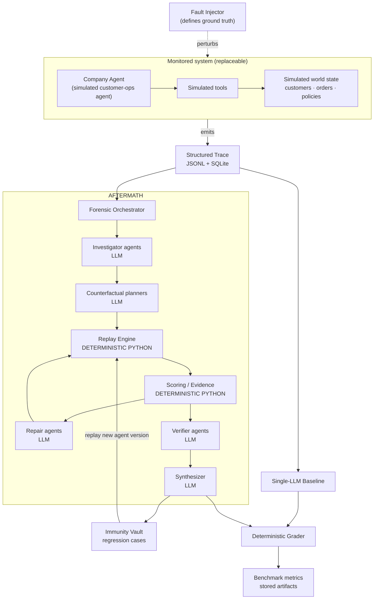
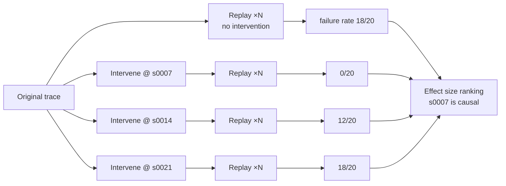

# AFTERMATH — Architecture

**Status:** Updated 2026-08-30, end of P6. Built: the monitored agent (world, tools, scenarios, oracles), the trace layer, the LLM provider abstraction, persistence, the API skeleton, and fault injection with a 5-incident benchmark. Built in P4–P5: the replay engine, counterfactual interventions, effect-size ranking, measurement-based cause/consequence separation, the repair guard library, the 4 MVP forensic agents with their orchestrator, and the Immunity Vault with its release gate. Not yet built, the immunity vault (P6), the benchmark (P7), the frontend (P9).

This document must match the real codebase; a stale diagram here is treated as a defect.

---

## 1. System overview



**The load-bearing distinction, visible in the diagram:** LLM agents (INV, CF, REP, VER, SYN) produce *proposals*. Deterministic Python (REPLAY, SCORE, GRADE) produces *facts*. Arrows never let a model decide an outcome that Python can measure.

## 2. Component responsibilities

| Component | Responsibility | LLM? |
|---|---|---|
| **Company Agent adapter** | Runs the monitored agent, emits a trace. Interface, not an implementation. | n/a |
| **Simulated world** | Deterministic, seeded state: customers, orders, policies, ledgers. | No |
| **Simulated tools** | The agent's action surface. Pure functions over world state. No real side effects. | No |
| **Fault Injector** | Perturbs a scenario in a controlled way and records the ground truth (`true_causal_step`, `injected_failure`). | No |
| **Trace layer** | Schema, collection, serialization, storage, stable step IDs, content hashing. | No |
| **Replay Engine** | Re-executes a trace deterministically; applies step-level interventions; runs N trials; reports outcomes. **Contains zero LLM calls.** | No |
| **Outcome scorer** | Decides pass/fail of a replayed run against the scenario's safety/correctness oracle. | No |
| **Investigators** | Read the trace, propose causal hypotheses bound to specific step IDs. | Yes |
| **Counterfactual planners** | Turn hypotheses into executable intervention specs. | Yes |
| **Repair agents** | Propose competing repair strategies once a cause has evidence. | Yes |
| **Verifiers** | Critique repairs: regression, utility/false-positive, adversarial. | Yes |
| **Synthesizer** | Assemble the final forensic report from evidence. | Yes |
| **Immunity Vault** | Store verified incidents as permanent regression cases; run the suite against any agent version. | No |
| **Benchmark harness** | Run AFTERMATH + baseline over the incident set; compute metrics from stored artifacts. | No |
| **Grader** | Compare a diagnosis to injector ground truth. Deterministic matching only. | No |
| **LLM provider** | Vendor abstraction; recording/replay of model calls; token accounting. | n/a |
| **API** | FastAPI surface for the frontend and CLI. | No |

## 3. Data flow — one incident, end to end

1. **Scenario run.** A scenario + seed + injector config runs the company agent. Every reasoning step, tool call, tool result, and state mutation is recorded as a trace step with a stable ID. Ground truth is written alongside — never derived from a model.
2. **Ingest.** Trace persisted (JSONL artifact + SQLite index), content-hashed.
3. **Investigate.** Investigator(s) read the trace and emit hypotheses: `{suspected_step_id, mechanism, confidence, supporting_step_ids}`.
4. **Plan counterfactuals.** Planner(s) convert the top hypotheses into `InterventionSpec`s — concrete, executable mutations (e.g. "at step 7, return the *current* policy version instead of the cached one").
5. **Experiment.** The replay engine executes, per hypothesis, N trials of the original and N of the intervened run. It reports failure rates. This is the evidence.
6. **Localize.** Deterministic scoring ranks hypotheses by *effect size* — the drop in failure rate caused by intervening. Not by agent confidence, not by vote count.
7. **Repair.** Repair agents propose competing strategies against the evidenced cause.
8. **Test repairs.** Each repair is replayed against (a) the incident, (b) a suite of normal cases. Deterministic scoring produces prevention rate and false-block rate.
9. **Verify.** Verifier agents critique the winning repair; the synthesizer writes the report.
10. **Immunize.** The incident + intervention + oracle become a permanent regression case. It must fail against the unrepaired agent and pass against the repaired one — both asserted in Python.

## 4. Trace schema (v1 draft)

Traces are JSONL, one step per line, plus an envelope. Concrete Pydantic models land in Phase 1; this is the shape they must express.

```jsonc
// Envelope
{
  "trace_id": "uuid",
  "scenario_id": "refund_duplicate_v1",
  "agent_version": "sim-custops-0.1.0",
  "seed": 1337,
  "injection": { "kind": "stale_policy", "params": {...} },   // null for clean runs
  "started_at": "...", "finished_at": "...",
  "outcome": { "status": "FAIL", "oracle": "duplicate_refund_detected" },
  "content_hash": "sha256:..."
}
```

```jsonc
// Step (discriminated on `type`)
{
  "step_id": "s0007",          // stable, ordinal, referenced by hypotheses & interventions
  "parent_id": "s0006",
  "type": "tool_call",         // user_input | agent_reasoning | tool_call | tool_result
                               // | state_mutation | policy_check | approval_request | final_output
  "ts": "...",
  "payload": { ... },          // type-specific, Pydantic-validated
  "world_snapshot_ref": "w0007", // enables state restoration during replay
  "nondeterminism": { "source": "llm", "record_id": "llmcall_0007" } // null if deterministic
}
```

**Design constraints on the schema:**
- `step_id` is stable across replays of the same seed — hypotheses and interventions address steps by ID, so this is load-bearing.
- Every nondeterministic step carries a record reference, so replay can reproduce it exactly instead of re-sampling.
- `world_snapshot_ref` lets replay restore state and branch from any step.
- The schema is agent-framework-agnostic. An external agent integrates by emitting this format.

## 5. Replay & counterfactual model



Replay modes:
- **Strict** — every nondeterministic call served from the record. Fully reproducible; used for regression tests.
- **Resampled** — model calls re-executed under a fixed seed policy; used for N-trial statistics where variance is the point.
- Intervention kinds: replace tool result, alter world state, modify a prompt/context element, drop or reorder a step, force a policy/approval outcome.

**Prohibited:** asking a model whether a replayed run failed. The scenario oracle decides, in Python.

## 6. Provider & framework abstractions

```
llm/base.py      LLMProvider protocol: complete(), stream(), token accounting
llm/gemini.py    initial implementation
llm/mock.py      deterministic test double
llm/recording.py record/replay wrapper for reproducibility
```

```
companyagent/base.py       CompanyAgent protocol: run(scenario, seed, hooks) -> Trace
companyagent/simple.py     MVP in-process agent: minimal custom loop (D-004)
companyagent/world.py      seeded simulated state; integer `day`, no wall clock
companyagent/tools.py      the 7 simulated tools; no real side effects
companyagent/scenarios.py  scenarios + deterministic oracles
companyagent/adk.py        (not built) optional ADK adapter, framework-agnosticism demo
companyagent/external.py   future: ingest a trace from an outside system
```

Rules: no vendor SDK import outside `llm/` and `companyagent/`. No forensics module may know which provider or framework is in use. Swapping Gemini → another provider must touch exactly one file.

## 7. Persistence

SQLite via a thin repository layer (`persistence/`) — no ORM lock-in beyond SQLAlchemy Core if used. Tables (initial): `traces`, `steps`, `incidents`, `hypotheses`, `experiments`, `experiment_runs`, `repairs`, `repair_evaluations`, `verdicts`, `regression_cases`, `benchmark_runs`, `llm_calls`. Large payloads (full traces, reports) live as files under `data/artifacts/` with the DB holding paths and hashes. PostgreSQL migration is a future phase; the repository layer is the seam.

## 8. API boundaries (initial)

```
POST /scenarios/{id}/run          run company agent, return trace_id
GET  /traces/{trace_id}           trace envelope + steps
POST /incidents/{id}/investigate  run the forensic pipeline
GET  /incidents/{id}/report       final forensic report + evidence
POST /experiments                 run a specific counterfactual experiment
GET  /immunity/suite              regression cases
POST /immunity/run                replay suite against an agent version
POST /benchmark/run               AFTERMATH + baseline over the incident set
GET  /benchmark/{run_id}          metrics from stored artifacts
```

Long-running pipeline calls return a job id and stream progress; the UI's "running" state must map to a real job state.

## 9. Folder structure (planned)

```
AFTERMATH/
├─ CLAUDE.md  README.md  .gitignore  .env.example
├─ .claude/agents/            # dev sub-agents (NOT product agents)
├─ docs/
├─ data/
│  ├─ incidents/              # incident definitions + ground truth
│  └─ artifacts/              # traces, experiment outputs, reports (gitignored)
├─ backend/
│  ├─ pyproject.toml
│  ├─ aftermath/
│  │  ├─ config.py
│  │  ├─ core/                # trace schema, ids, hashing, errors, types
│  │  ├─ llm/                 # provider abstraction
│  │  ├─ companyagent/        # monitored agent + tools + simulated world
│  │  ├─ tracing/             # collection, serialization, storage
│  │  ├─ injection/           # fault injection + ground truth
│  │  ├─ replay/              # DETERMINISTIC engine, interventions, scoring
│  │  ├─ forensics/           # runtime agents + orchestrator
│  │  │  ├─ investigators/  counterfactual/  repair/  verify/  synthesize/
│  │  ├─ immunity/            # regression vault
│  │  ├─ benchmark/           # baseline, runner, grader, metrics
│  │  ├─ persistence/         # SQLite repositories
│  │  └─ api/                 # FastAPI routers
│  └─ tests/                  # mirrors package layout
└─ frontend/                  # later phase
```

## 10. Layering rule

```
api → forensics/benchmark/immunity → replay → tracing → core
                                   ↘ llm (only forensics & benchmark)
                                   ↘ companyagent (only tracing & replay)
```

Lower never imports higher. `core` imports nothing project-internal. **`replay/`, `immunity/`, and `benchmark/` (excluding the baseline module) must contain no LLM imports — this is enforced by a test.**

## 11. Future TEE boundary

The Secure Forensic Vault will wrap ingestion and replay:

```
untrusted trace → [ redaction · secrets detection · normalization ]
                → [ TRUST BOUNDARY ]
                → encrypted store → attested replay → hashed evidence
```

The boundary is being kept clean now (ingestion is already a distinct step; artifacts are already hashed) so the vault can be inserted later without restructuring. **Nothing in the codebase or UI may claim TEE, attestation, or confidential computing until it genuinely runs there.**
