# AFTERMATH — Runtime (Product) Agents

> **Scope boundary.** This document describes AI agents that run **inside the AFTERMATH product**. It has nothing to do with the Claude Code development sub-agents in `.claude/agents/` (`project-manager`, `coder`, `tester`, `reviewer`), which build this repository. Never document one in the other's file, and never conflate them.

**Status:** design only. **No runtime agent is implemented yet.** MVP target is 4 agents (P5); the full swarm is P8 and contingent on measurement.

---

## 1. The rule every runtime agent obeys

**AGENTS THINK. PYTHON TESTS.**

A runtime agent may: read a trace, form hypotheses, design an experiment, propose a repair, critique, and write prose. A runtime agent may **not**: decide whether a replayed run failed, compute a failure rate, rank hypotheses by evidence, score a repair, or produce a metric. Those are deterministic Python (`replay/`, `benchmark/`, `immunity/`).

Every agent has a **strict Pydantic input and output schema**. Free-form text is never consumed by downstream logic — only validated structured output is.

Every causal claim in a final report must cite a stored experiment artifact. A claim without an experiment is labeled as an unverified hypothesis, not a finding.

---

## 2. MVP runtime agents (Phase 5) — 4 agents

### 2.1 Investigator (1 in MVP)

**Responsibility.** Read the failed trace and propose causal hypotheses, each bound to a specific `step_id`.

**Input.** Trace envelope + steps (redacted as needed), scenario description, observed failure. **Not given** the ground truth — ever.

**Output.**
```jsonc
{ "hypotheses": [ {
    "hypothesis_id": "h1",
    "suspected_step_id": "s0007",
    "mechanism": "policy fetched at s0007 was a cached prior version; refund computed against stale terms",
    "supporting_step_ids": ["s0007","s0031","s0040"],
    "confidence": 0.72,          // advisory only — never used to rank the final answer
    "falsifiable_prediction": "replacing the s0007 result with the current policy prevents the failure"
} ] }
```

**Constraint.** `confidence` is advisory. Final ranking comes from replay effect size (see §4). An agent's certainty carries no evidential weight.

### 2.2 Counterfactual Planner (1 in MVP)

**Responsibility.** Convert hypotheses into **executable** intervention specifications.

**Output.**
```jsonc
{ "experiments": [ {
    "experiment_id": "e1", "hypothesis_id": "h1",
    "intervention": { "kind": "replace_tool_result", "step_id": "s0007",
                      "replacement": { "policy_version": "current" } },
    "trials": 20, "replay_mode": "resampled",
    "expected_if_true": "failure rate drops materially",
    "expected_if_false": "failure rate unchanged"
} ] }
```

**Constraint.** Interventions must be **minimal and surgical** — change one thing. A plan that alters several steps at once cannot localize a cause. The planner must also propose at least one negative control (an intervention at a step it believes is *not* causal), so we can detect an engine that "fixes" everything.

### 2.3 Repair Agent (1 in MVP; becomes a 4-way tournament in P8)

**Responsibility.** Given an evidenced cause, propose a concrete repair — a guardrail, a tool change, a validation step, a context fix, or a policy check.

**Output.** Repair id, strategy class, description, concrete change specification, expected prevention mechanism, anticipated side effects.

**Constraint.** Repairs are **proposals**. They are accepted only after Python measures prevention rate on the incident and false-block rate on normal cases. A repair that prevents the incident by blocking everything must lose, and the utility measurement is what catches that.

### 2.4 Verifier (1 in MVP; becomes 3 in P8)

**Responsibility.** Adversarially critique the winning repair and the evidence chain: does the evidence actually support the conclusion, does the repair over-block, what does it miss, what breaks.

**Constraint.** The verifier reads **measured results**, not agent opinions. It may flag that evidence is insufficient — which is a valid and valuable outcome.

---

## 3. Full swarm design (Phase 8 — build only where measurement justifies)

### Stage 1 — Investigation (5)
| Agent | Lens |
|---|---|
| Reasoning Investigator | Faulty inference, goal drift, hallucinated premises, misread tool output |
| Tool/API Investigator | Wrong tool, wrong arguments, misinterpreted results, retry and idempotency errors |
| Context & Memory Investigator | Stale context, dropped/omitted information, memory contamination, truncation |
| Security & Policy Investigator | Prompt injection, policy violation, approval bypass, permission errors |
| State & Systems Investigator | State transitions, partial failures, timeouts, ordering, duplication |

Independent perspectives, not five copies of one prompt. Independence is the point: overlapping hypotheses from distinct lenses are cheap; identical hypotheses from identical prompts are waste.

### Stage 2 — Counterfactual planning (3)
Three planners designing distinct experiment strategies (direct intervention, upstream-state intervention, context/prompt intervention). Then the **deterministic replay engine** runs them.

### Stage 3 — Repair tournament (4)
Minimal · Reliability · Security/Safety · Systems-level. Deliberately different philosophies, so the tournament compares real alternatives rather than four phrasings of one idea. Then the **deterministic test engine** evaluates them.

### Stage 4 — Verification (3)
Regression Verifier (does it prevent recurrence) · Utility/False-Positive Verifier (does it break normal cases) · Adversarial Verifier (how would I defeat this fix).

### Stage 5 — Synthesis (1)
Final Forensic Synthesizer: assembles the report strictly from measured evidence. It may not introduce a causal claim that no experiment supports.

**Ceiling:** ~16 agents, plus adaptive escalation of up to 2 additional specialists for hard incidents.

---

## 4. Orchestration & the ranking rule

```mermaid
flowchart LR
    T[Trace] --> I[Investigators] --> H[Hypotheses]
    H --> P[Counterfactual planners] --> X[InterventionSpecs]
    X --> R{{Replay Engine · PYTHON}} --> E[Effect sizes]
    E --> RANK{{Ranking · PYTHON}} --> C[Evidenced cause]
    C --> RP[Repair agents] --> CAND[Candidates]
    CAND --> TE{{Test engine · PYTHON}} --> SEL{{Selection · PYTHON}}
    SEL --> V[Verifiers] --> S[Synthesizer] --> REP[Report + Immunity case]
```



**The ranking rule, stated explicitly because it is the project's spine:**

> Hypotheses are ranked by **measured effect size** — the reduction in failure rate produced by intervening at the suspected step — not by agent confidence, not by how many agents proposed it, and not by how persuasive the explanation reads.

A hypothesis that every agent loves and no experiment supports loses to one that a single agent proposed with low confidence and an experiment confirmed. This is tested directly in P5.

---

## 5. Agent-count experiments (P8)

Configurations swept: **1 / 3 / 5 / 7 investigators** (and analogous sweeps for planners and repairs).

Measured per configuration, from stored artifacts: root-cause localization accuracy · end-to-end latency · token and API cost · useful-hypothesis diversity (distinct correct mechanisms proposed) · marginal gain per added agent.

**We do not assume more agents is better.** If 3 investigators match 7 at a fraction of the cost, the production configuration is 3 and that is the published finding. A null or negative result here is a legitimate contribution and gets reported in `docs/CHANGELOG.md` either way.

---

## 6. Prompt & schema management

Prompts live in versioned files under `forensics/<role>/prompts/`, never inline in logic — they are experimental variables and must be diffable and swappable. Each agent's I/O schema is a Pydantic model in its module. Prompt or schema changes are recorded in `docs/CHANGELOG.md` with their measured effect.

## 7. Safety constraints on runtime agents

- No runtime agent takes a consequential external action. They read traces and emit structured proposals.
- Agents never see secrets; traces are redacted before ingestion (redaction hardens in P10/P11).
- Agents never receive incident ground truth — that would invalidate the entire measurement.
- All model calls go through `llm/` with recording, so any run is reproducible and its cost is accounted.
